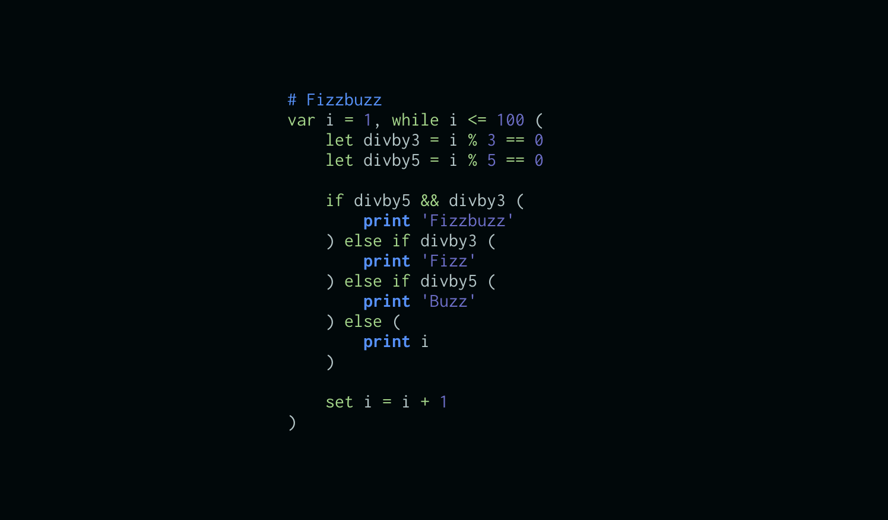

# The Nope Script

Nope is a scripting programming language, optimised for small and fun programs

### Nope is
 - Fun
 - Expression based
 - Garbage collected
 - Imperative with a sprinkle of functional
 - Focused on solving practical problems
 - Separates data from logic
 - Can represent JSON and XML natively
 - A single binary
 - Built with Rust
 - Will include a fully featured stdlib
 - Will have an eventloop concurrency model



## Run and Install


Install rust / cargo then

> cargo install nope-lang

You can then launch the interactive repl with

> nope

Or run a script with

> nope myscript.nope


## Roadmap

> This is project is currently at a very very early stage
> - [x] evaluate expressions
> - [x] global, local variables and scopes
> - [x] constant & operators
> - [x] math stdlib
> - [x] loops
> - [ ] functions
> - [ ] dictionaries and arrays
> - [ ] garbage collector
> - [ ] errors, try catch
> - [ ] string stdlib
> - [ ] parsing & serialization
> - [ ] utils stdlib
> - [ ] resource type
> - [ ] os stdlib
> - [ ] unit tests
> - [ ] v1.0
> - [ ] async
> - [ ] async stdlib
> - [ ] v2.0
> - [ ] web server
> - [ ] v3.0
> - [ ] modules & packages
> - [ ] v4.0
> - [ ] perf


## Types

The following table should give you an idea of the basic types and allowed data models. Keep in mind arrays and objects are not
implemented at the moment

``` 
[
    null: null,
    void: [void _ ()]
    bool: [true false]
    num:  [0 1 99 3.14 -1_000_000 0xdead 0b10101 NaN Inf PI]
    string: ['foo' "bar" ~hello]
    arrays: [1 2 true null []]
    dicts:  {key:32 val:99}
    mixed:  ['foo' key:'value']
]
```
All data in nope is a combination of the above types and structures.

Note that numbers are 64bit floats, and the strings are unicode.

## Code structure

Let's look at basic nope program.

```
let x = d6() + d6()
var winning = false

if x >= 10 (
    set winning = true
    print 'haha, yes! :)'
) else (
    print 'oh no :('
)

```

In the first line, we define a variable called `x`, with an initial value defined
by an expression which calls two functions 'd6' and adds the results. The variable
'x' is available in all subsequent expressions in the current scope. Since it
is defined with `let`, it cannot later be changed with `set`.

In the second line we declare another variable, but this time it can be modified.

We then evaluate a classic if-else conditional. Note that unlike other languages,
the code blocks are not defined by curly braces `{`/`}` but by parenthesis `(`/`)`. 
The reason is that nope is an expression based language, so every nope construct is
an expression that produces a value.

The following example puts those principles in action

```
let res = if flip_coin(), "heads" else "tails"
```

The `if` returns a value, which depending on the result of `flip_coin()` will be
either the string "heads" or "tails". 

You can surround expressions with parenthesis, and you can also surround multiple
expressions with parenthesis. In the later case, all expressions are evaluated in
order, but only the last expression produces a value.

This is what we've used to both change the variable `winning` with the `set winning = true`
expression, but also to print a message.

Note as well that the print expression `print "hey"` ommits parenthesis around its argument
This is not a special case of the print function. In nope, all parenthesis and commas for
functions arguments are optional.

```
let clamped_0_100 = max 0 min value 100
```

This is also applies to functions without parameters

```
let score = d6 + d6 + d6
```

Note that function application has the highest precedence so `print 1 + 1` prints `1`
since the addition is performed afterwards. This is not always what you want. One way
is to use parenthesis `print(1 + 1)`, `print (1 + 1)`. Note
that the space between the function name and the first parenthesis is meaningful. Without
space, the full list of arguments is expected, while with the space, it's just parenthesis
around a single argument; `max(1,2)` / `max (1) (2)`

Another way is to use the left arrow `<-` operator. This operator simply evaluates the complete expression
on the right. So you can do your print like this `print <- 1 + 1`.

By convention, all functions in nope take the data they operate on as the last argument.

```
let txt = read_text 'file.txt'
let txt2 = upper txt
write_txt 'file2.txt' txt2
```

With the help of the left arrow `<-` operator you could have instead written the following,

```
write_txt 'file2.txt' <- upper <- read_text 'file.txt'
```

The right arrow `->` operator (not yet implemented) does the same but the other way around.

```
read_text 'file.txt' -> upper -> write_txt 'file2.txt'
```


## Operators

#### Equality `==`, `!=`

Check that the operands are of the same type, and if that's the case compare their values or references

#### Comparison `<`, `>`, `<=`, `>=`

First converts the number to their number equivalent (NaN for strings and arrays) then compares

The `+-=`and `!+-=` compare numbers for equality up to `EPSILON` precision

#### Arithmetic `+`, `-`, `*`, `/`, `%`, `**`, 

The usual math operations. Operands are converted to their number equivalent (NaN for string)

Addition `+` of a string will perform string concatenation, and convert the other operand to string

#### Integer & Bitwise Arithmetic

All the arithmetic operators prefixed with `~` will first convert operands to int32 then perform the integer arithmetic operation.

For example `10 ~/ 4` is `2`

The bitwise operators `~!`, `~|`, `~&`, `~^`, `~<<`, `~>>`, `~>>>`
convert the operands to int32 then perform the bitwise operations


#### Boolean `!`, `||`, `&&`

The boolean equivalent of an operand is
 - `false` if `null`, `void` or `0`
 - `true` otherwise

The operators
- `!` negates the boolean equivalent
- `&&` returns the first operand if falsy, otherwise the second
- `||` returns the first operand if truthy, otherwise the second

#### Default `??`

Will return the second operand if the first is `null` or `void` otherwise the first

#### Repeat `*:`

The repeat operator will evaluate and sum the second operand N times, where N is the first operand. 

For example, this will throw the dice 3 times

```
print(3 *: d6)
```

Note that the first operand is first converted to a number. If the number is zero or negative, we return `void`.


## Loops

Nope supports two looping mechanism, `loop` which endlessly repeats the expression that follows and `while`,
which evaluates a condition and repeats the next expression as long as the condition stays truthy.

```
var i = 0, while i < 10 (
    set i = print i + 1
)
```

`continue` will jump directly to the next iteration, and `break` will stop the iteration

```
var i = 0, loop (
    if i < 10 (
        set i = i + 1
        continue
    )
    break
)
```

loops are expressions too and return the last value of their expression. `break` returns void, `break_as` will break
and return the next expression

```
var i = 0, let res = loop (
    if i < 10 (
        set i = i + 1
    ) else (
        break_as 'done!'
    )
)
```

## Printing to the terminal

`print` and `echo` are similar functions, they take one argument, print the value to the terminal, and returns it. The difference is that `print` prints the raw string converted value, while `echo` prints a colored internal representation of the value.

In the repl, each submission is echoed after execution.

Note that since both `print` and `echo` return their argument, you can use them inside expressions to display temporary values.

```
var i = 0, while i < 10 (
    set x = print x + 1
)
```

## Types check & conversions

The following functions convert to their type, `to_num`, `to_bool`, `to_str`

The following function test the types: `is_void`, `is_null`, `is_bool`, `is_num`, `is_int`, `is_nan`, `is_odd`, `is_even`, `is_str`

## Arithmetic Functions and constants

Nope supports the following arithmetic functions

- `floor`, `ceil`, `abs`, `acos`, `acosh`, `sin`, `sinh`, `asin`, `asinh`, `cos`, `cosh`, `tan`, `tanh`, `atan`, `atanh`, `inv` `log2`, `log10`, `ln`, `ln1p`, `exp`, `expm1`, `sqrt`, `cbrt`, `round`, `fround`, `trunc`, `sign`, `max`, `min`, `pow`, `atan2`

And the following arithemtic constants

- `NaN`, `Inf`, `PI`, `E`, `SQRT_2`, `SQRT_2PI`, `LN_2`, `LN_10`, `LOG2_10`, `LOG2_E`, `LOG10_2`, `LOG10_E`, `PHI`, `TAU`, `EPISLON`, `MAX|MIN_INT` `MAX|MIN_F64`, `MAX|MIN_I32|16|8`, `MAX_U32|16|8`

## Strings

- `len` returns the length of the string (scans the whole string)
- `upper`, `lower` transform the case of the string
- `trim` removes the whitespace at the beginning and end of the string
- `char_at(idx, text)` gets the character at string index
- `substr(from_idx, to_idx, text)`, returns the substring based on character indexes. `to_idx` is not inclusive. Negative indexes start at the end.
- `replace(from, to, text)` replaces the instances of `from` in `text` to `to`
- `find(substr, str)`, returns the position of `substr` in `str` or `-1`
- `contains(substr, str)` returns `true` if `substr` is a substring of `str`
- `bitstr` transforms a number to its bitwise representation as a string

## Randomness

Nope supports the following rng functions

- `random`, `flip_coin`, `rand100`, `d4`, `d6`, `d8`, `d10`, `d12`, `d20`, `d100`

If you want to return the sum of 3 dice throws it is better to use the repeat operator `3*:d6`


## Units

Nope allows you to annotate number literal with a unit suffix.

```
let distance = cos 45deg * (10Km + 3miles + 5yd + 3in + 5cm)
```

The units convert the number to their SI units equivalent. For example all distances are converted to meters.

The information about the unit of a number is not kept at runtime. Units are nothing more than a convenient syntax trick.

The following units are supported:

`pi`, `tau`, `phi`, `GT`, `MT`, `kT`, `T`, `kg`, `g`, `mg`, `ug`, `ng`, `Ti`, `Gi`, `Mi`, `ki`, `d`, 
`h`, `min`, `s`, `ms`, `us`, `ns`, `moon`, `deg`, `rad`, `in`, `km`, `m`, `dm`, `cm`, `mm`, `um`, `nm`, 
`lb`, `oz`, `mile`, `miles`, `ft`, `yd`, `F`, `C`, `K`, `m3`, `l`, `dm3`, `dl`, `cl`, `ml`, `cm3`, 
`barrel`, `cuft`, `ft3`, `gal`, `pint`, `cuin`, `in3`, `cuyd`, `yd3`, `m2`, `dm2`, `cm2`, `mm2`, `a`, 
`ha`, `km2`, `mile2`, `yd2`, `sqyd`, `ft2`, `sqft`, `in2`, `sqin`, `belgium`, `footballfield`, `TiB`, 
`TB`, `GiB`, `GB`, `MiB`, `MB`, `KiB`, `KB`, `million`, `billion`, `trillion`, `quadrillon`, `milli`, 
`thousandth`, `micro`, `nano`, `pico`, 

It is also possible to convert from one unit to another at runtime with the `from_unit` and `to_unit` functions.

```
let area_sqin = to_unit 'sqin' <- from_unit 'ha' <- 50
```

